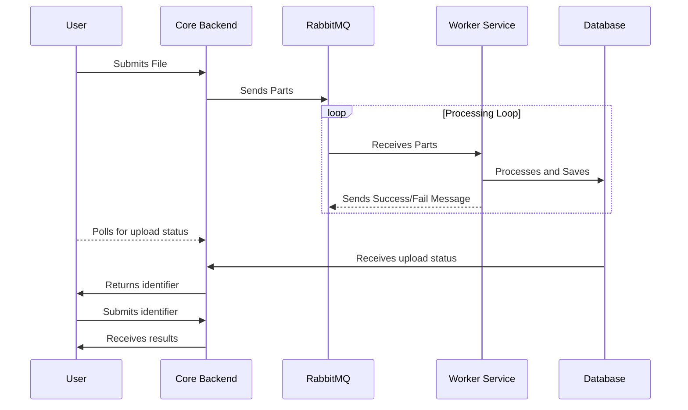

# Wordcloud app

---
Upload text file up to 100MB in size and generate word count JSON and a word cloud from the most frequent words

To run program make sure all the project folders(core, worker, frontend) are in the same directory.
Also make sure that ports 5173, 5672, 15672 and 8000 are free.
```bash
docker-compose up
```

When all the containers are up and running navigate to the following address to use the application:
[Application](http://localhost:5173)

# Flowchart

---

